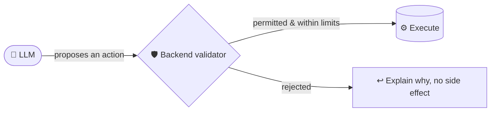
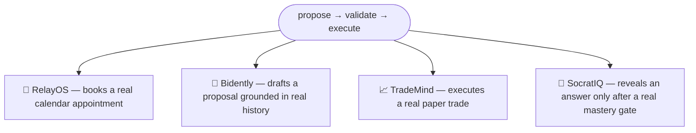

# Muhammad Bilal

Software engineer building AI-native systems that reason, act, and ship.

&nbsp;
&nbsp;
&nbsp;

---

## The pattern behind everything I build

I don't trust a model with unrestricted access to a real system. Every project below is that same rule, applied to a different domain.

`PLANTEA` sits underneath all of it — the full-stack foundation (auth, roles, data, mobile) the pattern above is built on top of.

---

## Projects

| | Problem | Boundary that makes it real, not a demo |
|---|---|---|
| **[RelayOS](https://github.com/MuhammadBilal561/RelayOS)** | Businesses lose leads because nobody replies fast enough | Every booking runs through a server-validated function — the AI can't touch the calendar directly |
| **[Bidently](https://github.com/MuhammadBilal561/Bidently)** | Tender responses take days and are easy to get wrong | Proposal drafts are grounded in the org's own past submissions, not generated from nothing |
| **[TradeMind](https://github.com/MuhammadBilal561/TradeMind)** | "Let the AI trade for me" is usually reckless | Risk checks sit between the agent's decision and the actual order — paper markets only |
| **[SocratIQ](https://github.com/MuhammadBilal561/SocratIQ)** | AI tutoring usually just gives the answer away | The solution is withheld until you've actually attempted it |
| **[PLANTEA](https://github.com/MuhammadBilal561/PLANTEA)** | Full-stack mobile marketplace, three real user roles | Buyers, sellers, and delivery riders — not a single-user CRUD demo |

---

## Stack

**AI layer** — LLM function-calling · RAG · pgvector · agentic workflows
**Building toward** — Go · Kubernetes (starting from a real `HAMi` PR, not yet shipped)

---

## Activity

---

**build → validate → ship**

