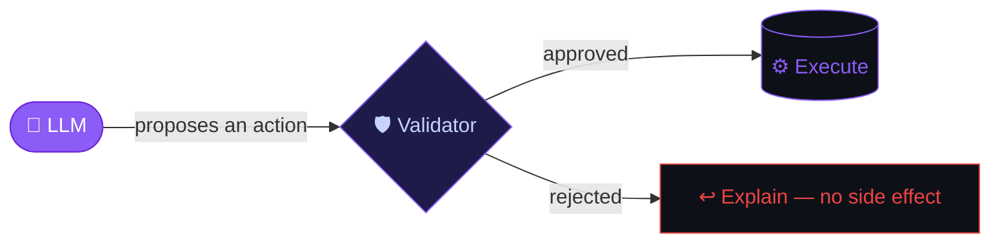
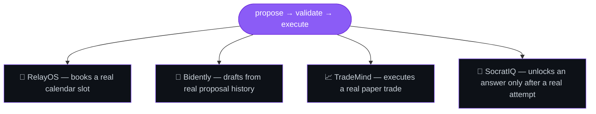
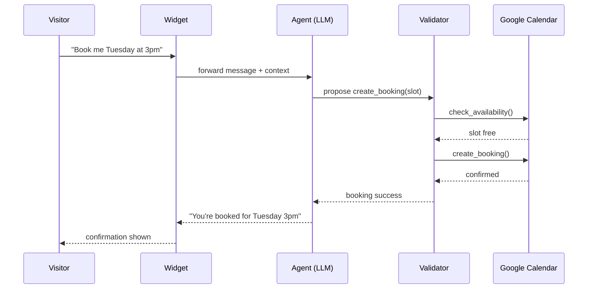

# Muhammad Bilal

Software engineer building AI-native systems that reason, act, and ship.

&nbsp;
&nbsp;
&nbsp;

---

## The pattern behind everything I build

I don't trust a model with unrestricted access to a real system. Every project below is that rule, applied to a different domain.

`PLANTEA` is the full-stack foundation underneath all of it — auth, roles, real data, mobile — the ground the pattern above stands on.

<strong>Zoom in: how RelayOS actually enforces this, request by request</strong>

The agent is never allowed to call `create_booking` without a preceding `check_availability` in the same conversation — enforced in the system prompt and verifiable in the logged tool-call history, not just assumed.

---

## Projects

| | Problem | Boundary that makes it real, not a demo |
|---|---|---|
| **[TradeMind](https://github.com/MuhammadBilal561/TradeMind)** | "Let the AI trade for me" is usually reckless | Strict backend risk checks sit between the agent's decision and the order execution via Alpaca. |
| **[RelayOS](https://github.com/MuhammadBilal561/RelayOS)** | Businesses lose leads because nobody replies fast enough | Every booking runs through a server-validated function — the AI can't touch the calendar directly. |
| **[Bidently](https://github.com/MuhammadBilal561/Bidently)** | Tender responses take days and are easy to get wrong | Drafts are grounded purely in the org's own past submissions via RAG, not generated from nothing. |
| **[SocratIQ](https://github.com/MuhammadBilal561/SocratIQ)** | AI tutoring usually just hands you the answer | The solution stays hidden behind a mastery gate until the user has actually attempted it. |
| **[PLANTEA](https://github.com/MuhammadBilal561/PLANTEA)** | Full-stack mobile marketplace, three real user roles | Buyers, sellers, and delivery riders managing distinct workflows — not a single-user CRUD demo. |

---

## Stack & Current Focus

**The AI Layer:** `LLM function-calling` · `RAG` · `pgvector` · `Agentic workflows`

> [!NOTE]  
> **Currently focused on High-Concurrency Systems & Cloud-Native Infrastructure:**  
> Building a custom TCP Load Balancer in **Go** to deepen my understanding of network protocols and goroutines, while actively contributing to CNCF open-source projects like `Project-HAMi`.

---

**build → validate → ship**

Open to internships & collaboration — [Email](mailto:bilalrehan013@gmail.com) · [LinkedIn](https://www.linkedin.com/in/muhammadbilal561)

